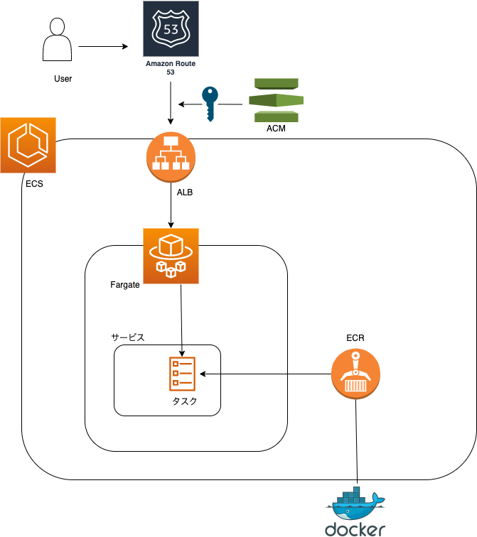

# Spa Web Site Backend

Spa Web Site のバックエンドである

## 環境

nestjs/apollo: "^10.0.5"
graphql: "^16.3.0"
prisma: "^3.10.0"
typescript: "^4.3.5"

## ER 図

## インフラアーキテクチャ 図

## 該当する GitHub リポジトリ

nest-js-apollo

## アップデート予定の issue

・GoogleMapAPI の導入に伴い、lat: string,lng: string のカラム追加
・画像登録に伴い、picture: string のカラム追加
